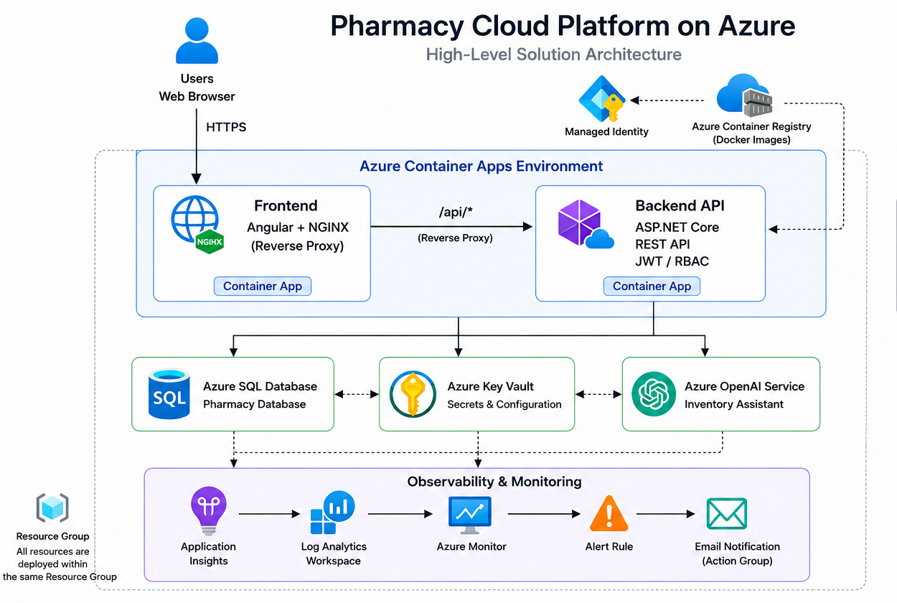

# Pharmacy Cloud Platform on Azure

## Overview

**Pharmacy Cloud Platform** is a full-stack, cloud-native pharmacy management application designed, developed and deployed from scratch on Microsoft Azure.

The platform manages products, categories, customers, employees, inventory and invoices, while incorporating authentication, authorization, monitoring, health checks, rate limiting, centralized exception handling, AI-assisted inventory analysis and automated cloud deployment.

The project demonstrates practical experience across .NET backend development, Angular, SQL Server, Azure administration, cloud architecture, containerization, security, observability, Infrastructure as Code and AI integration.

All application code, database objects, infrastructure definitions and deployment automation were implemented specifically for this project.

---

# Solution Architecture



## Architecture Overview

The platform uses a container-based architecture deployed on **Azure Container Apps**.

```text
                          User / Browser
                                │
                                ▼
                    Azure Container Apps
                    ┌─────────────────────┐
                    │ Angular + NGINX     │
                    │ Frontend Container  │
                    └──────────┬──────────┘
                               │
                         /api/*
                               │
                               ▼
                    Azure Container Apps
                    ┌─────────────────────┐
                    │ ASP.NET Core API    │
                    │ Backend Container   │
                    └──────┬──────┬───────┘
                           │      │
             ┌─────────────┘      └──────────────┐
             ▼                                   ▼
      Azure SQL Database                  Azure OpenAI
             │
             │
             ▼
       Azure Key Vault


      Azure Container Registry
             │
       ┌─────┴─────┐
       ▼           ▼
   Frontend       API
    image        image

                    Application Insights
                            │
                            ▼
                    Azure Monitor /
                    Log Analytics
```

Infrastructure is defined using **Bicep** and deployed through a PowerShell automation process.

The deployment process provisions the infrastructure, builds the application images, initializes the database and deploys the frontend and backend containers.

---

# Technology Stack

## Backend

The backend is built with ASP.NET Core and .NET 9 using Entity Framework Core for database access.

Key technologies include:

* ASP.NET Core / .NET 9
* Entity Framework Core
* SQL Server
* LINQ
* REST API
* Swagger / OpenAPI
* BCrypt
* Serilog
* ASP.NET Core Health Checks
* ASP.NET Core Rate Limiting
* Response Caching
* Azure OpenAI SDK

## Frontend

The frontend is implemented using Angular and follows a feature-oriented structure.

Key technologies include:

* Angular
* TypeScript
* HTML
* CSS
* Angular HttpClient
* HTTP Interceptors
* JWT Token Storage
* NGINX

## Azure & Infrastructure

The deployed solution uses:

* Azure Container Apps
* Azure Container Registry
* Azure SQL Database
* Azure Key Vault
* Azure OpenAI Service
* Azure Application Insights
* Azure Monitor
* Log Analytics
* Azure RBAC
* Managed Identity
* Bicep
* PowerShell
* Docker

---

# Application Features

## Product Management

Products can be created and managed with support for categories, stock, expiration dates, presentation types and active/inactive status.

Collection endpoints support pagination, filtering, sorting and search.

## Customer Management

Customers can be created, updated and searched through the API and frontend.

Customer listings use the same pagination, filtering, sorting and search pattern used throughout the application.

## Employee Management

Employees can be created and administered according to application roles.

Administrators can provision an employee with an initial password. After authentication, employees can change their own password.

Different DTOs are used according to the operation and business context to avoid exposing unnecessary employee information.

## Invoice Management

The platform supports invoice creation, listing, status management and detail retrieval.

Invoice creation is implemented through a SQL Server stored procedure executed inside a transaction, ensuring that the complete operation succeeds or is rolled back atomically.

Invoice summaries and details are intentionally separated so that invoice lines and related product information are only retrieved when required.

## Inventory

The inventory module provides visibility into current stock, low-stock products, out-of-stock products and products approaching expiration.

The Azure environment also includes an alert configured for the out-of-stock condition, notifying the configured email recipient when the monitored threshold reaches zero.

## Dashboard

The dashboard presents aggregated operational metrics rather than exposing raw database entities.

Examples include:

* Monthly revenue
* Inventory status
* Out-of-stock products
* Other operational indicators

Queries are designed around the required metrics and return only the information needed by the dashboard.

## Inventory Assistant

The platform includes an AI-powered inventory assistant.

Authorized users can ask natural-language questions about inventory information, for example:

* Which products are low on stock?
* Which products are approaching expiration?
* How many active products are registered?
* How many categories are available?

The backend retrieves relevant information from Azure SQL Database and provides it to Azure OpenAI for natural-language interpretation.

The assistant therefore operates on **real application data** rather than functioning as an isolated chatbot.

---

# Backend & API

The backend exposes a REST API using ASP.NET Core.

Swagger/OpenAPI provides interactive API documentation and independent testing of the backend.

The API includes functionality for:

* Authentication
* Products
* Categories
* Customers
* Employees
* Invoices
* Dashboard
* Inventory Assistant
* Health checks

## Reliability

### Global Exception Handling

Unhandled application exceptions are handled through centralized middleware.

This provides consistent exception logging, HTTP status mapping and API error responses without repeating `try/catch` logic throughout controllers.

### Rate Limiting

API rate limiting controls request frequency and provides an additional protection layer against excessive or abusive traffic.

### Health Checks

The API exposes health endpoints that can be used to verify application availability independently from business endpoints.

```http
GET /health
GET /diagnostics/ping
```

### Response Caching

Response caching is used for suitable API responses to reduce repeated database requests and improve response performance.

---

# Database

The database was designed specifically for the application and is hosted on Azure SQL Database.

Main entities include:

* Product
* Category
* Customer
* Invoice
* InvoiceLine
* OrderStatus
* Assignment
* Employee

The database implementation includes primary and foreign keys, constraints, referential integrity, transactions, stored procedures, business validations and soft-delete strategies.

---

# Performance & Query Design

Performance was considered at both the API and database levels.

## Common Query Infrastructure

Collection endpoints use a shared `QueryParameters` pattern for pagination, filtering, sorting and search.

A generic `QueryableExtensions` implementation centralizes the query-building logic, reducing duplication across controllers and keeping list endpoints consistent.

## Projection

Queries select only the fields required by each operation whenever possible instead of loading complete entities.

This reduces database work, network traffic, memory usage and serialization overhead.

## N+1 Query Prevention

Related entities are not unnecessarily loaded when they are not required.

Invoice summaries and invoice details, for example, are retrieved separately so that large related object graphs are not loaded for every invoice request.

---

# Security

Security is implemented at both the application and Azure infrastructure levels.

## Authentication

The API uses JWT-based authentication.

Passwords are hashed using BCrypt and are never stored as plain text.

## Authorization

Protected endpoints use application roles:

* Admin
* Sales
* Pharmacist

Role requirements are enforced at the API endpoint level.

## DTO-Based Data Exposure

DTOs are used as the public API contract instead of exposing database entities directly.

Employee-related operations use different DTOs according to their business context, preventing unnecessary or sensitive information from being returned.

## Password Ownership

Administrators can create employees and provision their initial credentials.

Once authenticated, employees control their own password changes and cannot arbitrarily modify another employee's credentials.

## Secret Management

Sensitive configuration is separated from application source code and container images.

Azure Key Vault and environment-based configuration are used to provide environment-specific and sensitive values at deployment/runtime.

## Managed Identity & RBAC

Azure Managed Identity is used where possible instead of storing long-lived Azure credentials.

The Container Apps use a user-assigned managed identity to authenticate against Azure Container Registry through Azure RBAC, allowing the containers to pull images without embedding registry credentials.

---

# Observability & Monitoring

The platform uses Azure-native monitoring services for centralized observability:

* Application Insights
* Azure Monitor
* Log Analytics

Application telemetry can be used to investigate:

* HTTP requests
* Response times
* Failed requests
* Exceptions
* Dependency failures
* Application availability

Health endpoints provide an additional mechanism for verifying application availability.

---

# Frontend Architecture

The Angular application follows a **feature-oriented architecture**.

Functionality is organized by feature rather than placing all components, services and models into global folders.

Current application features include:

* Authentication
* Product management
* Category management
* Customer management
* Employee management
* Invoice management
* Dashboard
* Inventory Assistant

## Authentication

The frontend uses a dedicated `TokenStorageService` for JWT token management.

An HTTP interceptor centralizes authentication-related HTTP handling instead of requiring every API call to manually manage authentication information.

## NGINX Reverse Proxy

NGINX runs inside the frontend container and acts as a reverse proxy between the browser and the backend API.

Frontend requests use the same public origin:

```text
/api/*
```

NGINX forwards these requests internally to the ASP.NET Core API.

This means the Angular application does not contain an environment-specific API hostname and the browser does not need to communicate directly with the backend Container App hostname.

The backend URL is injected dynamically into the NGINX container configuration during deployment, allowing the same frontend image to be reused across environments.

---

# Containerization

Both application layers are containerized.

The ASP.NET Core API is published into a .NET runtime container.

The Angular application is compiled into static assets and served through NGINX.

The resulting images are stored in Azure Container Registry and deployed to Azure Container Apps.

Environment-specific configuration is supplied during deployment instead of being embedded into the application images.

---

# Infrastructure as Code

The Azure infrastructure is defined using **Bicep**.

The infrastructure includes the resources required by the application, including:

* Resource Group
* Azure SQL Database
* Azure Container Registry
* Azure Container Apps Environment
* Azure Container Apps
* Azure Key Vault
* Managed Identity
* Application Insights
* Monitoring resources
* Required RBAC role assignments
* SQL access configuration

The infrastructure can therefore be recreated without manually configuring every resource through the Azure Portal.

## Infrastructure Outputs

Bicep deployment outputs are consumed by the deployment process to dynamically obtain Azure resource information.

This avoids hard-coding environment-specific values such as:

* Resource identifiers
* Container Registry endpoints
* Container App URLs
* Key Vault endpoints
* Application Insights configuration

---

# Deployment Automation

The repository includes a PowerShell deployment process that orchestrates the complete deployment lifecycle.

The process:

1. Retrieves the current public IP address.
2. Deploys the base Azure infrastructure using Bicep.
3. Retrieves infrastructure outputs.
4. Builds the API image using Azure Container Registry.
5. Builds the Angular/NGINX image using Azure Container Registry.
6. Configures SQL firewall access required for database initialization.
7. Initializes the database.
8. Deploys the API and frontend Container Apps.
9. Configures environment-specific frontend API routing.
10. Outputs the deployed application URLs.

The deployment is therefore reproducible without manually configuring the Azure resources after deployment.

---

# Architectural Decisions

The implementation intentionally favors simple, reusable and maintainable patterns rather than introducing Azure services that are not required by the application.

## SQL Transaction for Invoice Creation

Invoice creation modifies multiple related records.

The operation is implemented through a SQL Server stored procedure with a transaction so that the database guarantees atomicity: either the complete invoice operation succeeds or the changes are rolled back.

Keeping this transaction close to the data also reduces the risk of partial updates caused by multiple independent API database operations.

## Generic Query Infrastructure

Pagination, filtering, sorting and search are implemented through reusable query parameters and generic `IQueryable` extensions.

This avoids duplicating the same query-building logic across every controller and keeps collection endpoints consistent.

## Projection Instead of Complete Entity Loading

The API uses projections when only specific fields are required.

This prevents unnecessary entity loading and reduces database work, memory usage, network traffic and serialization overhead.

## Separate Invoice Summary and Details

Invoices are not always returned together with every invoice line and related product.

`InvoiceDto` contains invoice-level information, while `InvoiceDetailsDto` is used when detailed information is explicitly requested.

This keeps normal invoice listings lightweight and avoids unnecessary loading of related object graphs.

## Global Exception Middleware

Exception handling is centralized in middleware instead of being repeated inside controllers.

This provides one place for logging, HTTP error mapping and consistent error responses.

## Role-Specific DTOs

DTOs are designed according to the business context of each operation.

This creates a clear boundary between persistence models and public API contracts while reducing unnecessary data exposure.

## Password Ownership

Employee provisioning and password ownership are intentionally separated.

Administrators create employee accounts and provide initial credentials, while authenticated employees control their own password changes.

## NGINX Reverse Proxy

NGINX provides a reverse-proxy layer between the Angular frontend and ASP.NET Core API.

Requests under `/api/*` are forwarded internally to the API using a dynamically configured backend URL.

This removes environment-specific API URLs from Angular source code and allows the same frontend container image to be reused across deployments.

## Environment-Based Configuration

Environment-specific and sensitive configuration values are supplied during deployment instead of being hard-coded into source code or container images.

This allows the same application artifacts to be deployed to different environments without rebuilding them because an endpoint or secret changed.

## Managed Identity

Managed Identity is used for Azure resource authentication where appropriate.

Container Apps authenticate against Azure Container Registry through Azure RBAC instead of storing registry credentials inside the application.

## Infrastructure Outputs

Bicep outputs are used as the source of dynamically generated Azure resource information for subsequent deployment steps.

This prevents environment-specific resource URLs and identifiers from being hard-coded into deployment scripts or application configuration.

---

# Testing

Unit tests are included for the application's business logic and services.

The majority of services have corresponding unit tests.

`DashboardService` is the main exception because some of its LINQ queries depend on SQL Server-specific behavior that is not fully compatible with the EF Core InMemory provider.

Those queries are therefore better validated against the actual SQL Server database rather than relying exclusively on an in-memory implementation.

---

# Project Structure

```text
Pharmacy-Azure-Platform/
│
├── database/
│   ├── dacpac/
│   │   └── PharmacyDatabase.dacpac
│   │
│   ├── deploy/
│   │   └── InitializeDatabase.ps1
│   │
│   ├── docker/
│   │   ├── Dockerfile
│   │   └── init.sh
│   │
│   └── schema/
│       ├── Pharmacy_Schema.sql
│       └── Pharmacy_SeedData.sql
│
├── docs/
│   ├── endpoints.txt
│   └── architecture/
│       └── Azure Solution Diagram.png
│
├── infra/
│   ├── ai/
│   │   ├── main.bicep
│   │   └── modules/
│   │       └── openai.bicep
│   │
│   ├── containers/
│   │   ├── main.bicep
│   │   └── modules/
│   │       ├── acr.bicep
│   │       ├── acrPullRoleAssignment.bicep
│   │       ├── apiContainerApp.bicep
│   │       ├── containerAppEnvironment.bicep
│   │       └── frontendContainerApp.bicep
│   │
│   ├── data/
│   │   ├── main.bicep
│   │   └── modules/
│   │       ├── sqlDatabase.bicep
│   │       └── sqlServer.bicep
│   │
│   ├── monitoring/
│   │   ├── main.bicep
│   │   ├── availability.bicep
│   │   └── modules/
│   │         ├── actionGroup.bicep
│   │         ├── alerts.bicep
│   │         ├── applicationInsights.bicep
│   │         ├── availabilityTest.bicep
│   │         └── logAnalytics.bicep
│   │
│   ├── security/
│   │   ├── main.bicep
│   │   └── modules/
│   │       ├── keyVault.bicep
│   │       ├── keyVaultRoleAssignment.bicep
│   │       └── managedIdentity.bicep
│   │
│   ├── main.bicep
│   └── main.parameters.json
│
├── src/
│   ├── PharmacyApiEF/
│   ├── PharmacyApiEF.Tests/
│   └── PharmacyAngular/
│
├── Pharmacy-Azure-Platform/
│   └── Pharmacy-Azure-Platform.sln
│
├── .dockerignore
├── .gitignore
├── .env.example
├── docker-compose.yml
├── deploy.ps1
└── README.md
```

Application code, database deployment and Azure infrastructure are intentionally separated.

---

# Deployment Prerequisites

The deployment environment requires:

* Azure CLI
* PowerShell
* Docker-compatible development environment
* Azure subscription
* Authenticated Azure CLI session

Required infrastructure values must be configured in the parameter file before deployment.

---

# Deployment

The complete environment can be deployed using:

```powershell
./deploy.ps1
```

The script orchestrates infrastructure deployment, container image builds, database initialization and Container Apps deployment.

After a successful deployment, the script outputs the deployed frontend and API URLs.

If you want to redeploy the infrastructure, you must first delete the resource group and then execute the following commands for the resources that are subject to soft delete.

```powershell
az keyvault purge --name "pharmacy-kv-dev"
 
az cognitiveservices account purge --name "pharmacy-ai-dev" --resource-group "RG-pharmacy-ob-test" --location "westus3"
```

# Steps to follow

### 1. Clone the repository

git clone https://github.com/NicolasDagys/pharmacy-azure-platform.git

cd Pharmacy-Azure-Platform

### 2. Configure deployment secrets

Copy the example environment file:

Copy-Item .env.example .env

Edit `.env` and provide your own values:

ADMINISTRATOR_PASSWORD=<YOUR_SQL_ADMIN_PASSWORD>
JWT_KEY=<YOUR_JWT_SECRET_KEY>

Do not commit `.env`.

### 3. Configure deployment parameters

Edit:

infra/main.parameters.json

Set your Azure region, resource group, environment and Action Group email.

### 4. Login to Azure

az login

Make sure the selected subscription has sufficient permissions to create Azure resources.

### 5. Deploy the platform

.\deploy.ps1

The deployment script provisions the Azure infrastructure, builds the container images in Azure Container Registry, initializes the database and deploys the API and Angular frontend.

### 6. Access the application

After deployment, the script prints:

API URL
Frontend URL

Open the Frontend URL in a browser.
---

# API Documentation

Swagger/OpenAPI is available from the deployed API.

It can be used to inspect endpoints, review request and response models, authenticate and execute API requests independently from the Angular frontend.

---

# Key Engineering Practices

The project demonstrates:

* Layered backend architecture
* Feature-oriented frontend architecture
* DTO-based API contracts
* JWT authentication
* Role-based authorization
* BCrypt password hashing
* Azure Managed Identity
* Azure RBAC
* Azure Key Vault
* Global exception handling
* Structured logging
* Health checks
* Rate limiting
* Response caching
* Query optimization
* Pagination, filtering, sorting and search
* SQL transactions
* Stored procedures
* Unit testing
* Docker containerization
* Infrastructure as Code
* Automated deployment
* Azure monitoring
* Application telemetry
* AI integration
* Environment-independent container images

---

# What This Project Demonstrates

Pharmacy Cloud Platform demonstrates the complete lifecycle of a cloud application:

```text
Application Design
       ↓
Database Design
       ↓
Backend Development
       ↓
Frontend Development
       ↓
Security
       ↓
Containerization
       ↓
Infrastructure as Code
       ↓
Azure Deployment
       ↓
Monitoring & Observability
       ↓
AI Integration
       ↓
Deployment Automation
```

The objective was not simply to deploy an application to Azure, but to demonstrate how an application can be designed, secured, containerized, deployed, monitored and operated using Azure-native services.

---

# Author

**Nicolas Dagys**

System Analyst · .NET Developer · Azure Engineer

Microsoft Certified:

* AZ-900 — Microsoft Azure Fundamentals
* AZ-104 — Microsoft Azure Administrator Associate

 [Nicolás Dagys](https://linkedin.com)

 [nicolasdagys@gmail.com](mailto:nicolasdagys@gmail.com)


---

# Project Status

The implemented version of the project is complete and deployed on Microsoft Azure.

The repository represents the architecture, features and infrastructure that are actually implemented rather than a list of planned or hypothetical cloud services.


-----------------------------------------------------------------

----------------------------------------------------------------------------------------------------

